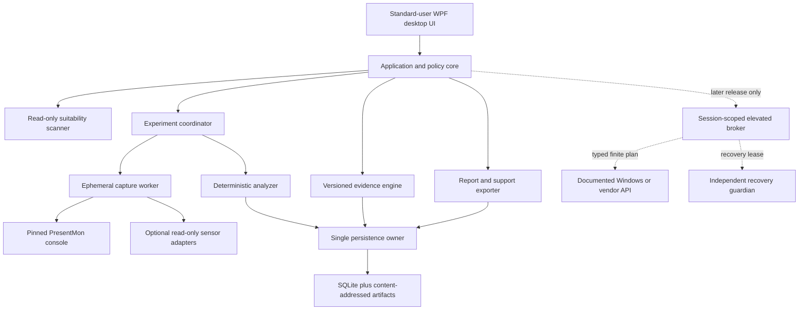

# CS2 Latency and Frame-Consistency App — Build Roadmap v1.0

**Status:** Product and engineering roadmap; no application code has been started  
**Date:** 25 August 2026  
**Inputs:** `CS2_Latency_Performance_App_Research_Scope_Audited_v1.1.md`, `CS2_Latency_Performance_App_Audit_Findings.md`, and the subsequent gap review

---

## 1. Executive decision

Build the product in this order:

1. **Internal research harness** — prove the collector, metrics, scenario and storage model.
2. **Read-only desktop product** — scan, explain and benchmark without changing the PC.
3. **Guided experiments** — the user changes one supported setting through its official UI while the app measures and verifies what it can.
4. **Public v1** — read-only diagnostics plus only those guided experiments that have passed their research gates.
5. **Narrow automation preview** — one allowlisted change type, only after state, security and recovery validation.
6. **Controlled expansion** — add automatic operations individually; never create a generic tweak engine.

The app remains valuable if automation never becomes safe enough to ship. A result of **no supported change is likely to help**, **already correctly configured**, or **insufficient evidence** is a successful product outcome.

### Proposed release names

| Release | Product boundary | System writes |
|---|---|---:|
| **R0 — Research harness** | Internal CLI and laboratory analysis | None |
| **R1 — Read-only alpha** | Scanner, baseline benchmark and local report | None |
| **R2 — Guided decision beta** | Calibrated A/A and one-card guided experiments | No app-controlled writes; the user changes settings through official UI |
| **V1.0 — Public guided product** | Read-only product plus promoted guided experiments | User performs changes in official UI |
| **V1.5 — Automation preview** | One independently qualified automatic operation | One typed, reversible operation |
| **V2+ — Controlled expansion** | Additional independently promoted operations | No generic write surface |

This naming replaces the audited document's ambiguous use of “v1” for several different products.

---

## 2. Product boundaries

### The product will

- Inventory the supported Windows, GPU, display, render-route, driver and CS2 environment.
- Distinguish configured state, target/scope, effective engagement and persistence.
- Measure frame delivery and supported software latency fields using a pinned, headless collector.
- Run repeatable A/A and A/B-style experiments using run-level statistics.
- Explain evidence, applicability, trade-offs, uncertainty and missing capabilities.
- Produce local, versioned and reproducible reports.
- Treat rollback, no-change and insufficient-evidence outcomes as first-class results.

### The product will never

- Inject or load code into `cs2.exe`, hook the game, read/write game memory, suspend the process or manipulate process priority/affinity.
- Intercept, inspect, modify, delay, replay or synthesize packets.
- Simulate gameplay input, automate play or require a protected online match for testing.
- Modify game binaries, protected files, Steam Cloud data or unsupported configs.
- Install a kernel driver, permanent privileged service, overlay or generic registry-tweak engine.
- Disable Windows security, Trusted Mode or core services.
- Use `-insecure`, `-allow_third_party_software` or an equivalent weakening option for a decision-grade test.
- Offer “Optimize all,” a synthetic latency score, guaranteed gains or a competitive-advantage claim.

Valve states that Trusted Mode blocks third-party files from interacting with CS2. The product therefore prohibits game-process interaction and must say **designed to avoid game-process interaction and observed compatible with the named versions**, never “VAC certified” or “guaranteed safe.” ([Valve Trusted Mode](https://help.steampowered.com/en/faqs/view/09A0-4879-4353-EF95), [Valve VAC policy](https://help.steampowered.com/en/faqs/view/571A-97DA-70E9-FF74))

---

## 3. Initial supported-platform boundary

The exact OS, CS2, collector and driver builds are frozen at each release candidate. “Current” is never used as a compatibility rule.

### Tier 1 — decision-grade target for public v1

- Supported Windows 11 x64 releases named in the release manifest.
- Local physical machine; no Remote Desktop, VM, cloud stream or unresolved virtual display.
- Exactly one active, directly attached display for the initial decision-grade path.
- Supported NVIDIA or AMD discrete-GPU systems with a resolved render/display route.
- Standard SDR path initially; HDR, DSC and complex scaling paths remain read-only until qualified.
- Supported CS2 build and a qualified scenario revision.
- Pinned collector build and validated metric schema.

### Tier 2 — read-only or provisional

- Intel graphics.
- Hybrid-GPU laptops and OEM MUX/Advanced Optimus configurations.
- Multi-monitor and mixed-refresh systems.
- HDR, DSC, dock/eGPU and dynamic-refresh configurations.
- Battery operation and thermally constrained portable systems.

Tier 2 is not presented as unsupported hardware. Support is recorded **per capability, metric and experiment**, not assigned once to the whole PC. The app inventories each available path, explains limitations and permits only metrics and experiments that passed their applicable route and observer checks.

### Explicitly diagnostic-only

- Windows Insider/pre-release builds.
- Remote, virtualized or streamed display paths.
- Unknown collector, driver, game or evidence versions.
- Unresolved render/display adapter identity.

---

## 4. Proposed implementation stack

This is the starting architecture, subject to short Phase 0 spikes rather than an open-ended technology evaluation.

- **Language/runtime:** C# on **.NET 10 LTS**, x64. Microsoft lists .NET 10 as supported through November 2028. ([Microsoft .NET support policy](https://learn.microsoft.com/en-us/dotnet/core/releases-and-support))
- **Desktop UI:** WPF, with the application core independent of WPF. It is the lower-risk choice for a Windows-only systems utility, mature keyboard/accessibility behaviour and straightforward native API interop.
- **Packaging:** signed MSIX is the preferred read-only-v1 path if the Phase 0 collector and permissions spike passes; otherwise use a signed MSI. Microsoft supports packaging WPF applications with MSIX. ([Microsoft MSIX guidance](https://learn.microsoft.com/en-us/windows/apps/desktop/modernize/dotnet/package-app))
- **Primary frame collector:** one exact, reviewed tag/commit of the standalone PresentMon console or directly reviewed collection library. The selected binary must contain no enabled injection/overlay feature; preferably build the reviewed console with those features absent. Pin documentation to the selected tag and reject input-tracking, overlay or injection arguments in acceptance tests. Do not ship or invoke its service or capture UI. ([PresentMon console](https://github.com/GameTechDev/PresentMon/blob/main/README-ConsoleApplication.md), [PresentMon components](https://github.com/GameTechDev/PresentMon))
- **Local database:** SQLite with WAL and an appropriately strict synchronous mode, accompanied by a content-addressed artifact store. ([SQLite WAL](https://sqlite.org/wal.html), [SQLite synchronous modes](https://sqlite.org/pragma.html#pragma_synchronous))
- **Research reference implementation:** an offline Python or R analysis project may independently reproduce statistical calculations. Python/R is not embedded in the consumer app.
- **Diagnostics:** WPR/WPA traces are opt-in support or laboratory workflows, never an ordinary benchmark dependency.
- **Privilege model:** no broker in public v1. A short-lived elevated capture worker is considered only if the qualified ETW path genuinely requires it and only after separate capture/privacy consent.

### Packaging decision spike

Before committing to MSIX, prove that the exact PresentMon component can be packaged, signature-checked, launched and stopped without an overlay, service or unreviewed helper; that required ETW access works; and that crash cleanup does not leave an ETW session behind. The spike also covers optional capture elevation and consent, LocalAppData ownership, update/uninstall recovery interlocks and compatibility with the later broker model. If any condition fails, choose signed MSI rather than weakening the collector boundary.

---

## 5. Target architecture



No component runs inside CS2. The desktop UI never mutates Windows or driver state directly.

### Solution modules

| Module | Responsibility |
|---|---|
| `App.Desktop` | Scan, consent, progress, explanations, reports and guided restoration |
| `App.Core` | Policy, state machines, capability handling and outcome language |
| `Platform.Windows` | Supported Windows/display/power discovery APIs |
| `Collectors.PresentMon` | Exact binary validation, launch, stop, parsing and health checks |
| `Sensors` | Optional, read-only, vendor-specific telemetry with provenance |
| `Experiments` | Scenario control, randomization, blocks, quality gates and resume |
| `Analysis` | Metric definitions, run summaries, intervals and decision rules |
| `Evidence` | Signed cards, applicability, dependencies, expiry and revocation |
| `Persistence` | SQLite, artifact commit protocol, retention and reconciliation |
| `Reporting` | Human-readable Markdown/PDF-ready data and machine-readable JSON |
| `Research.Cli` | Headless internal harness and golden-corpus runner |
| `Broker` | Later only: typed allowlisted operations, no arbitrary commands/paths |
| `Recovery` | Later only: leases, crash recovery and offline restoration |

### Data records

- `EnvironmentSnapshot`
- `DeviceIdentity` and `DisplayRoute`
- `ScenarioDefinition` and `ScenarioAsset`
- `CollectorProvenance` and `SensorProviderProvenance`
- `MetricDefinition`, `MetricCapability` and `MetricResult`
- `ConfiguredStateObservation`, `TargetScopeObservation`, `EngagementObservation` and `PersistenceObservation`
- `CaptureRun`, `CaptureArtifact` and `Invalidation`
- `ExperimentProtocol`, `Block`, `Arm` and `RunAssignment`
- `DecisionResult` and `Report`
- `EvidenceCard`, `EvidenceManifest` and `CompatibilityRule`
- Later: `ChangeTransaction`, `OperationStep` and `RecoveryLease`

Every conclusion-affecting record has a schema version and content hash. Derived results are append-only; recalculation creates a new result version.

### Artifact commit sequence

1. Write to a uniquely named temporary file inside the app-owned data directory.
2. Flush and close it.
3. Calculate its SHA-256 hash and validate size/schema limits.
4. Create the content-addressed final entry without overwrite. If it already exists, reopen it and verify hash, size, owner and DACL before reuse.
5. Commit the database record referencing that hash.
6. Durably flush the directory/metadata operations supported by the selected filesystem contract.
7. On startup, reconcile incomplete records, a final artifact created before its database reference, and orphaned temporary files without guessing success.

SQLite WAL does not by itself make external ETL/CSV artifacts transactional, so both layers require recovery testing.

---

## 6. Collector and sensor contract

### PresentMon

- Pin release, component, binary hash, signature, arguments and CSV/metric schema.
- Use only the reviewed standalone console or collection library.
- During Phase 0, prove that the selected component exposes a trustworthy required-provider event/buffer-loss health signal. If it does not, select a reviewed collection-library/ETW health path or classify its captures as non-decision-grade.
- Record target PID, swap chain, adapter LUID, QPC interval, present-mode distribution, collector health and lost-event counters.
- Treat any lost event/buffer in a decision-grade capture as an invalid run.
- Disable decision metrics that are not valid for the detected renderer/HAGS/marker configuration.
- Map raw software fields to honest names; never display `ClickToPhoton`-style software fields as a physical mouse-to-panel measurement.
- Re-run the golden corpus and observer study before any collector upgrade.

Microsoft documents that ETW consumers can lose events or buffers when consumers or storage cannot keep up. Collector health therefore belongs in the validity contract, not a debug log. ([Microsoft ETW overview](https://learn.microsoft.com/en-us/windows/win32/etw/about-event-tracing))

### Sensors

- Use separate reviewed read-only adapters for NVAPI, AMD ADLX and an approved Intel source where available.
- Complete SDK/DLL licensing, redistribution, safe-loading and ABI/version review before packaging any adapter.
- Record provider/build, adapter identity, requested and achieved cadence, monotonic timestamp, freshness and missing-data reason.
- Validate sensor-to-QPC mapping, discontinuities, gaps and aggregation rules. Low-rate vendor samples are guardrails/context, not per-frame causal measurements.
- Qualify polling off/on and at multiple cadences against the observer budget.
- A metric required as a safety guardrail is **mandatory**, not best-effort. Missing, stale, implausible or misaligned required telemetry blocks that experiment.
- Keep ADLX writes deferred. AMD currently publishes ADLX v1.5, but API availability alone does not establish application scope, persistence or safe rollback. ([AMD ADLX](https://gpuopen.com/adlx/))

### External imports

FrameView, CapFrameX, optical and ETL/CSV inputs are untrusted files:

- Bound file size, rows, columns, parse time and memory.
- Reject path traversal, reparse-point surprises, malformed encodings and unsupported schemas.
- Neutralize spreadsheet formulas in exported CSV.
- Preserve source and provenance labels.
- A FrameView CSV cannot prove its overlay architecture or capture conditions. Consumer imports are observational unless accompanied by a trusted, app-controlled capture manifest.

FrameView's software PC-latency interval excludes the mouse and physical display; its overlay paths also require separate observer qualification. ([FrameView 1.9 guide](https://images.nvidia.com/content/geforce/technologies/frameview/frameview-1-9-user-guide-web-version.pdf))

---

## 7. Benchmark and decision contract

### Scenario classes

1. **Frame-consistency scenario:** a hashed, build-compatible demo or supported local/workshop workload with an exact segment and capture anchor.
2. **Interactive-latency scenario:** a fixed local scene with valid software markers where supported; strong end-to-end claims require external optical instrumentation.

Every `ScenarioDefinition` includes:

- CS2 build and asset hashes.
- Supported launch-state allowlist and prohibited launch options.
- Render/display route and graphics-state hash.
- Exact start cue, capture interval, timeout and focus rules.
- Warm-up and temperature/clock/cache stationarity rule.
- Reset procedure and operator actions.
- Scene-drift and invalidation checks.
- Shader state class: stabilized warm state, or a separately labelled cold-cache laboratory study.

Before qualification, the capture interval is an **externally anchored candidate window**, not a deterministic window. It becomes decision-grade only after alignment error, stationarity, rejection rate, empirical A/A bias, calibrated resolution and positive-control sensitivity pass. If a consumer scenario cannot be aligned and repeated without prohibited process access or automation, it remains diagnostic/observational.

### Statistical unit and default policy

- The experimental unit is a run or randomized block, never an individual frame.
- Practical importance is defined separately from measurement resolution.
- Counts and capture duration come from calibration, not universal `5/5/3/200` rules.
- A maximum run count is fixed before treatment results are visible.
- Pauses, invalid retries, abandonments and later reruns remain subject to the preregistered stopping/multiplicity policy; a user cannot reset the error budget by repeatedly rerunning a losing card.
- The shipping implementation and an independent research implementation must agree on golden statistical fixtures.

### Decision algebra frozen before implementation

Every card declares one primary endpoint, beneficial direction, run/block hierarchy, estimator, confidence level, multiplicity family/adjustment, missing-run rule, equivalence band, guardrail non-inferiority limits, confirmation rule and stopping policy.

Normalize the treatment effect so positive always means benefit. If `B` is treatment and `A` is baseline, define `benefit = direction × (B - A)`, where `direction` is `+1` for higher-is-better and `-1` for lower-is-better metrics. A causal Keep requires the lower confidence bound of `benefit` to exceed the independently defined practical threshold. Each harm-oriented guardrail passes only when its upper confidence bound remains below its allowed non-inferiority limit. Equivalence requires the complete primary-effect interval to lie inside the preregistered equivalence band. The exact estimator and interval procedure are metric-schema data, not UI constants.

### Proposed initial validation targets

These are provisional product-policy hypotheses. Each must be justified and frozen before treatment data or holdout results are examined:

- Empirical family-wise A/A false-Keep rate: **no more than 5%**. Phase 0 defines whether the family is a card/session/catalogue sequence, how retries carry forward and the multiplicity/alpha-spending method. Monte Carlo count is chosen from a precision target and reported with a confidence bound; resampling units are whole blocks/sessions/machines, never frames, and held-out empirical A/A data confirm the simulation.
- Power: initially **at least 80%** for the smallest practical effect in each supported metric/scenario stratum. Each stratum must justify this target, variance model and maximum acceptable user burden; if the workload exceeds that burden, the path is not decision-grade.
- Observer effect: a per-metric error budget covers collector, sensors, application activity, scenario alignment and numerical uncertainty. One-third of the practical threshold is the initial engineering hypothesis for the combined software-observer allocation, not a universal fact; qualification uses an equivalence interval wholly inside the frozen budget.
- Valid decision-grade capture: **zero collector-lost events/buffers**.
- State targeting: **zero observed global/per-app or adapter/display misidentifications** in the declared release matrix, with the number of systems/transitions and an upper confidence bound on failure probability reported.
- Automatic recovery, when introduced: **zero observed unrecovered supported mutations** across the prespecified repeated/soak fault suite, with denominators, confidence bounds and residual-risk disclosure.

### Decision outcomes

- **Keep on this PC:** the beneficial interval clears the practical threshold, required state and engagement are verified, confirmation succeeds where required, and all guardrails pass.
- **Revert:** a primary or safety metric regresses, apply/verification fails, or the environment becomes unsafe.
- **Equivalent / no practically important difference:** the whole interval lies within the preregistered equivalence band and resolution was adequate.
- **Inconclusive / insufficient evidence:** the interval spans useful benefit and no benefit/regression; state, metric or environment validity failed; or the design lacked resolution.
- **Observational association:** the user-attested/manual state changed and measurements moved, but causal state engagement was not independently verified.

No causal Keep is allowed from user attestation alone.

---

## 8. Phase roadmap

Durations are planning ranges for a dedicated four-person core team with part-time statistics, security and legal review. They are estimates, not release promises.

### Phase 0 — Contracts, architecture and feasibility spikes

**Duration:** 3–5 weeks  
**Release:** none

#### Deliverables

- Freeze R0/R1/R2/V1/V1.5 product boundaries and non-goals.
- Architecture decision records for UI/runtime, collector component, packaging, persistence and support matrix.
- Threat model and negative-capability test list.
- Versioned schemas for scenario, environment, metrics, evidence and reports.
- Exact state-assurance model: configured provenance, target/scope, engagement and persistence.
- Privacy model, default retention, support export and crash-dump policy.
- Golden-corpus format and licensing classification.
- Low-fidelity scan → explain → benchmark → result UX prototype.
- Formative UX testing across novice and enthusiast users, including comprehension, time expectations, restoration, abandonment, keyboard use, high contrast, colour-independent status and reduced motion.
- Packaging/ETW permissions spike, trustworthy lost-event-health proof, collector redistribution review and sensor SDK/DLL review.
- Hardware-lab acquisition list.

#### Exit gate

- At least one candidate CS2 scenario has a lawful, non-injected start/capture contract ready for empirical qualification.
- Exact collector component can be launched and stopped without service, UI, overlay or injection.
- Unsupported/unknown/stale/no-safe-change outcomes exist in every relevant schema and screen.
- All prospective cards have prerequisite experiment IDs and release states.
- No unresolved licence or packaging issue blocks the internal harness.

### Phase 1 — Internal research harness

**Duration:** 10–12 weeks  
**Release:** R0

#### Build

- Headless capture runner.
- Pinned PresentMon validation and bounded parser.
- Environment snapshot and drift detector.
- Minimal route/display/thermal-state scanner and selected read-only sensor adapters needed to qualify A/A preconditions.
- Content-addressed artifacts and SQLite metadata.
- Scenario runner with manual start cue and deterministic capture window.
- A/A runner, randomization and quality-gate engine.
- Deterministic metric calculation and Markdown/JSON report.
- Golden valid, invalid, malformed and statistical fixtures whose expected outputs come from an independent oracle or manually reviewed derivation—not the shipping implementation.
- Startup reconciliation and disk-full/process-kill tests.
- Lab-only optical-result import contract.

#### Research

- Minimal collector and complete research-harness-stack observer effect. The installed desktop product is tested separately in Phase 2 and after every material UI/logging/sensor change.
- Scenario alignment and repeatability over restarts, boots, days and two operators.
- PresentMon metric semantics under present modes, HAGS and hybrid routes.
- Run-count and capture-duration calibration.
- Sensor availability and polling observer effect.
- Supported positive controls, such as a deliberately large reversible refresh/cap difference, to prove pipeline sensitivity; their results do not promote a production tweak.
- Optical correlation of software latency fields before any physical input-to-photon wording is permitted.

#### Exit gate

- All versioned golden valid fixtures produce the independently expected normalized records and metrics.
- All versioned invalid fixtures fail explicitly without guessing or hanging; schema-boundary, property/fuzz and resource-limit suites pass.
- Reanalysis is deterministic from stored artifacts and schemas.
- Every valid decision-grade lab run has zero lost ETW events/buffers.
- Research-harness observer effect is within its preregistered budget.
- Scenario alignment, stationarity, rejection rate, A/A bias/resolution and positive-control sensitivity pass, or the scenario is explicitly removed from the decision-grade path.
- Mandatory sensor capabilities and timebase alignment pass for each experiment that depends on them, or those experiment paths are removed.
- Crash/disk fault tests never create a false successful run.
- No recommendation or mutation path exists in the binary.

### Phase 2 — Read-only desktop alpha

**Duration:** 7–10 weeks  
**Release:** R1, internal then closed alpha

#### Build

- WPF shell and first-run safety/privacy explanation.
- Non-elevated suitability scanner.
- Platform tier and capability reporting.
- Findings grouped into confirmed, suspected, unavailable and excluded.
- Quick preview for setup/noise feasibility and decision-grade-duration estimation only. It can never produce Keep, Revert or a causal recommendation.
- Qualified baseline capture/report when the platform passes measurement-quality checks. A baseline alone cannot issue a tweak Keep decision.
- Quiet-capture mode: UI hidden, background writes batched, sensor cadence fixed.
- Local history and reproducible report.
- Redacted support-bundle preview.
- Retention and one-click deletion.
- “No safe change indicated” and “already correctly configured” outcomes.

#### Initial read-only findings

- Actual active refresh/mode and display route.
- Render and display adapter identity.
- Present mode, delivered cadence and frame-time distribution.
- VRR/configuration capability with honest provenance.
- Confidence-labelled GPU-saturation and thermal/power-limitation hypotheses until their classifiers pass labelled causal-validation studies.
- Time-correlated overlay/background contention observations. Process presence alone never blames software or recommends disabling a service; guided isolation is limited to a user-selected nonessential application and includes reopen/restoration instructions.
- Unsupported launch options or remote/virtual paths.

#### Exit gate

- Scanner performs no system/game/driver writes.
- No persistent service, driver, overlay or background updater is installed.
- With analytics and user-initiated update checks off, no application-process egress is observed across the named suite and monitoring method. The report distinguishes product traffic from Windows certificate, SmartScreen and revocation checks.
- Every graph has a tabular alternative; keyboard, screen-reader, high-contrast, colour-independent status, reduced-motion and text-scaling tests pass.
- The seeded privacy corpus passes redaction with reviewed false-positive/false-negative results; the product does not claim this proves removal of every possible real-world identifier.
- Unsupported systems receive bounded diagnostics rather than inferred advice.
- Full installed-app observer testing passes, not merely the collector test.
- Before any external closed-alpha distribution, binaries are signed and the SBOM, dependency, licence, redistribution and version-specific Trusted Mode/local-scenario checks pass.

### Phase 3 — Guided decision beta

**Duration:** 8–12 weeks  
**Release:** R2

#### Build

- Calibrated A/A qualification.
- Randomized paired or blocked experiments according to carryover class.
- Pause/resume, reboot checkpoints and environment requalification.
- Manual official-setting instructions and restoration instructions.
- One-card approval before the first manual change, including visual, power, restart, feature-loss and restoration consequences.
- Independent display of configured state, scope, engagement and persistence.
- Run-level interval/equivalence analysis and guardrail rules.
- Preregistered maximum count and multiplicity tracking across cards/reruns.
- Invalid-run retention and reason codes.
- Keep/Revert/Equivalent/Inconclusive/Observational outcomes.
- Per-arm user action, randomized order, maximum manual transitions, washout/reset, state requalification and restoration checkpoints. A deviation, pause, incomplete arm or abandonment ends the current block and invokes the preregistered recovery/stopping rule.

#### First candidate guided vertical slices

1. Highest suitable refresh and verified render/display route as a guided correction; causal performance language requires its own controlled experiment.
2. NVIDIA Reflex, manually changed in game, with its own game/build/read-state/engagement contract.
3. AMD integrated Anti-Lag 2, separately qualified with its own game/build/read-state/engagement contract.
4. One individual CS2 cap setting experiment.
5. Separate V-Sync or VRR cards only after one-factor qualification; a combined presentation-policy study requires a preregistered powered factorial design with interaction/carryover rules.
6. One-factor overlay isolation when time-correlated telemetry shows possible contention.

Each candidate remains research-only until its prerequisite experiment and state checks pass. Do not ship bundles in the first guided release.

#### Exit gate

- False-Keep and power targets pass on calibration systems and untouched validation machines.
- Holdouts are allocated before tuning, opened only after code/threshold/exclusion freeze, never reused as holdouts after inspection, and replaced after a failed promotion attempt.
- Manual scenario repeatability meets its target or is automatically downgraded to observational.
- No user-attested-only state receives a causal Keep.
- Game, driver, collector, route or evidence drift correctly stops and requalifies the session.
- Consumer testing validates estimated duration, comprehension, pause/resume and safe abandonment.
- Consumer acceptance criteria are preregistered for setting-entry accuracy, restoration success, uncertainty comprehension, predicted-versus-actual duration and abandonment recovery across novice and enthusiast strata.
- Every guided card has tested restoration instructions and a clear unverifiable-restoration state.

### Phase 4 — Public v1 hardening

**Duration:** 5–8 weeks  
**Release:** V1.0

#### Deliverables

- Signed production installer and binaries.
- SBOM, third-party notices, licence/trademark review and collector redistribution decision.
- Signed evidence catalogue with dependency-scoped expiry.
- Update manifest with monotonic sequence, highest-seen floor, key rotation and anti-downgrade design.
- Accessibility and privacy sign-off.
- Version-specific CS2/Trusted Mode compatibility testing in local/private contexts.
- Hardware support matrix and known-limitations page.
- Local health page showing collector, sensor, evidence and scenario versions.
- Crash-free and benchmark-abandonment telemetry measured locally during beta; upload remains opt-in and off by default.
- A separately consented beta-research programme is required for any cohort KPI. Its sampling frame, aggregate schema, retention, version strata, denominator and selection-bias limitation are published; local-only measurements cannot support fleet claims.
- Clean install, upgrade, uninstall, schema migration, interrupted update, application rollback and evidence-manifest rollback tests.
- A defined release-candidate soak period and no unresolved severity-1 or severity-2 defects.

#### Public-v1 definition of done

- No app-controlled Windows, driver, game or monitor setting writes.
- No injection, game-memory access, packet access, input automation or protected-online-test dependency.
- Every shipped recommendation card has passed its named promotion gate.
- Raw traces remain local; ordinary export excludes them.
- Deleting raw evidence leaves an explicit tombstone and marks historical results as no longer independently re-analysable.
- No evidence/version failure can silently broaden a claim.
- “No change” and “insufficient evidence” are normal, understandable results.

### Phase 5 — Mutation foundation and one automatic operation

**Duration:** 10–16 weeks after a stable guided release  
**Release:** V1.5 invitation-only preview

Do not choose the first mutation because it is easy to code. Select it only after guided evidence shows a useful cohort and the exact API/state model passes. The first preview supports **one operation type**.

Candidate selection uses a readiness scorecard rather than a preset ranking. Required dimensions are measured practical benefit, documented API support, state/engagement observability, exact target scope, mandatory guardrails, persistence, rollback reliability and recovery across session/reboot faults. Candidate families for scoring include Windows AC power mode, a highly constrained temporary display mode and a documented NVIDIA per-game value.

AMD writes remain deferred until ADLX application/global scope, persistence and compare-and-swap restoration are proven for an explicit driver range.

#### Build

- Session-scoped elevated broker, never a permanent service.
- UAC approves a finite hashed plan: operation ID, target, value bounds, transition count, expiry and rollback value.
- IPC bound to OS-observed logon/session/integrity, PID plus creation time and signed image identity.
- Typed bounded messages; no arbitrary command, executable, DLL, path, registry key or wildcard.
- Durable transaction journal and independent recovery lease.
- The independently authorized recovery guardian holds the exact pre-state and lease and retains only the authority required to revert if both UI and broker fail.
- Compare-and-swap rollback and external-change conflict handling.
- OS-global resource locks for display/power resources.
- Offline recovery entry point.
- For any persistent operation, define and threat-model a one-shot boot/logon recovery mechanism or prove the state is nonpersistent. If restoration cannot be guaranteed without the user reopening the app, that operation remains guided.
- Update/uninstall interlock while a transaction is unresolved.
- Reparse-point, junction and hard-link-safe privileged path handling.

#### Fault matrix

- UI, worker and broker termination at every transaction boundary.
- Lost IPC and lease expiry.
- Disk full, torn record and duplicate resume.
- User changes the same setting concurrently.
- Session lock, logoff, Fast User Switching, suspend and hibernate.
- Display hotplug/dock/eGPU change and AC/battery transition where applicable.
- Driver reset, game crash, reboot, app update and uninstall attempt.
- Evidence expires or is revoked while a rollback is pending.

#### Exit gate

- Zero observed unrecovered supported mutations across the declared repeated/soak matrix, with denominators, confidence bounds, residual-risk disclosure and a field rollback-failure stop/revocation policy.
- Expiry/revocation blocks new apply and Keep decisions but never recorded restoration.
- Zero observed target/scope misidentification in every exact automatic-operation OS/hardware/API allowlist cell. Covering-array evidence is not enough for automatic support; untested cells are excluded.
- Independent security review finds no reusable or arbitrary privileged operation surface.
- Canary rollback and false-recommendation targets remain inside their preregistered limits.
- Any unresolved state, quality field or mandatory sensor blocks application.

### Phase 6 — Controlled expansion and expert lab features

**Duration:** ongoing; no automatic calendar promise  
**Release:** V2+

- Add one mutation family at a time with a separate threat model, evidence card, state adapter, hardware matrix and fault suite.
- Consider documented NVIDIA writes before AMD writes only if their semantics are more completely validated; vendor ordering is evidence-driven, not preferential.
- Keep HAGS, Game Mode, USB/audio topology, high polling, cache operations, monitor DDC/CI, driver installation and network settings guided or excluded until their own research succeeds.
- Add opt-in WPR support traces, trusted lab import manifests and optical LDAT/Reflex Analyzer workflows.
- Keep link-impairment/network research outside the consumer product.

---

## 9. Validation programme

### Golden corpus

Include valid and hostile fixtures for:

- Composed, independent-flip and tearing-capable paths.
- V-Sync/VRR combinations, HAGS on/off and hybrid presents.
- Multiple swap chains, Alt-Tab, minimize, loading and process restart.
- Dropped/undisplayed frames, missing metrics and high-rate traces.
- Every supported collector schema.
- Truncated, malformed, oversized and formula-bearing CSV.
- Known statistical null, practical-effect, drift, missing-run and carryover cases.
- State snapshots for global/per-game/inherited values.
- Every transaction journal boundary before automation ships.
- Privacy fixtures containing seeded names, paths, Steam IDs, IPs and command lines.

Unknown collector versions fail as unsupported; they are never parsed as the nearest known version.

### Initial laboratory planning/budget floor

Use a risk-based covering array for read-only/guided interaction coverage rather than claiming the entire Cartesian product. Tier 1 cells are release-blocking; Tier 2 cells are exploratory unless a specific capability is promoted. The planning/budget floor is:

- At least 12 physically distinct PCs and 24 or more state configurations.
- NVIDIA, AMD and Intel render paths; at least one hybrid laptop per applicable vendor family.
- Hybrid-core and homogeneous Intel, AMD desktop and APU/portable CPU classes.
- 60/144/240/360+ Hz displays; fixed refresh and VRR; DisplayPort and HDMI.
- Single display plus mixed-refresh multi-monitor systems.
- SDR and representative HDR/DSC/scaling paths.
- HAGS on/off and supported fullscreen/borderless presentation paths.
- 125–8,000 Hz input devices and representative USB/audio paths for diagnostics, exercised only in the app's own focused calibration surface or lab workflow—never through a global hook or protected CS2 session.
- Exact driver branches/build ranges named by the release manifest.
- Untouched holdout machines for promotion validation.

This is a budget floor, not statistical proof. Phase 1 run-count/capture-duration calibration and observed between-machine heterogeneity determine claim-specific independent-machine counts. Every exact automatic-operation allowlist cell is tested directly; a covering array cannot qualify an untested write cell.

### Compatibility gate

- Static dependency/import review for injection, memory, hook, input and packet primitives.
- Verify that no product or collector module loads into `cs2.exe`.
- Verify that the product writes nothing under CS2/Steam game directories.
- Run signed-production-build startup, menu and local scenario tests in standard Trusted Mode.
- Record warnings, disconnects, crashes and relevant Steam/CS2 log changes.
- Repeat after each dependent CS2, Steam, collector or anti-cheat-relevant update.
- Never use absence of a warning or ban as certification.

---

## 10. UX roadmap

### Public v1 flow

1. **Welcome and boundary** — what the app measures, never does and cannot guarantee.
2. **Non-sensitive compatibility scan** — confirmed, provisional, unknown, excluded and stale capabilities.
3. **Just-in-time capture/privacy consent** — immediately before benchmarking, show artifact types, size and retention; request capture elevation separately and only if the qualified path requires it.
4. **Findings** — current state, provenance, evidence, trade-offs and whether measuring could be worthwhile.
5. **Benchmark choice** — quick preview or decision-grade, with honest time estimate.
6. **Preflight** — scenario, route, temperature/cache stationarity, updates, background contention and storage.
7. **Run** — clear progress, pause/resume and deterministic invalidation explanations.
8. **Result** — effect and interval, practical threshold, guardrails, assurance and outcome.
9. **Export/delete** — local Markdown/JSON report and redacted support preview.

### Guided experiment additions

1. Select exactly one card.
2. Review supported official setting path and restoration instructions.
3. Record/attest the original state.
4. User changes the setting.
5. Rescan and verify configuration/engagement separately.
6. Run randomized blocks.
7. Keep, restore, or label the result observational/inconclusive.
8. Verify restoration where possible; never call an attested restoration “verified.”

### Automatic experiment additions

1. Show exact before state, target, operation, duration, risks and recovery plan.
2. Obtain operation-specific approval and UAC.
3. Prepare and durably commit the recovery plan.
4. Execute only the finite preapproved randomized transition sequence, re-reading and semantically verifying every arm; cancellation or lease loss triggers immediate safe restoration.
5. Benchmark according to the locked plan.
6. The card must already be auto-eligible. Apply the distinct per-machine preregistered decision and guardrail rules to choose Keep versus compare-and-swap rollback.
7. Verify restored state and close the recovery lease.

---

## 11. Privacy, storage and support defaults

- Store consumer data under non-roaming per-user local application data with a protected user-only DACL.
- Analytics, account creation, advertising ID and background upload are absent/off by default.
- Product update/evidence checks are user initiated in v1.
- Raw capture default retention: **7 days or 2 GiB, whichever is reached first**, configurable before capture.
- Derived reports may be retained until deleted; if raw inputs expire, preserve a tombstone and mark the report non-reanalysable, ineligible for baseline reuse and unavailable for future confirmation.
- Never delete artifacts for an active capture or unresolved future transaction.
- Ordinary support bundles exclude raw ETL and unrelated process lists.
- A raw trace requires a separate expert consent, exact preview, size disclosure and retention control.
- Crash dumps are off by default; local opt-in dumps follow the same sensitive-artifact policy.
- Temporary files use the same protected directory and reconciliation rules as final artifacts.
- Do not promise forensic secure erase on SSDs.

---

## 12. Security and supply-chain gates

- Authenticode-sign every shipped executable and installer.
- Produce an SBOM and third-party notices per release.
- Pin collector/dependency source, release, component, binary hash and signature.
- Keep signed evidence and update manifests separate from application code.
- Use a monotonic manifest sequence and explicitly designed protected highest-seen mechanism to resist replay/downgrade. Scope the promise: ordinary user-writable state cannot resist a hostile same-user process without an additional OS-backed trust anchor.
- Define trust-root rotation, key-compromise recovery, system-clock rollback/freeze handling, emergency revocation and the limitation that an offline client cannot receive a new revocation.
- Fuzz all external importers and, later, privileged IPC framing/state machines.
- Refuse new work when a collector/evidence implementation is stale; preserve historical viewing and required rollback.
- No background updater, permanent service, kernel helper or arbitrary plugin loading.
- Update and uninstall are blocked during capture and, later, during an unresolved transaction.

---

## 13. Workstreams and ownership

### Minimum credible team

- **Windows performance engineer:** ETW, PresentMon, display/render routes and sensor qualification.
- **Desktop/product engineer:** WPF UI, application core, persistence, reporting and packaging.
- **Measurement/statistics engineer:** scenarios, A/A calibration, decision rules and lab optical correlation.
- **QA/lab engineer:** hardware matrix, automation, fault injection and release evidence.
- **Product/release owner:** accountable for scope and gates; this may be dual-hatted by the desktop/product lead, but cannot be left to an unowned committee.
- **Part-time security reviewer:** threat model, IPC/broker, updater and import parsers.
- **UX/accessibility researcher:** part-time throughout, with dedicated formative and release-test periods from R1 through V1.
- **Part-time legal/licensing/technical-writing review.**

A two-person team should stop at the research/read-only product until it can fund the hardware, statistical, security and recovery work. It should not compress those gates to preserve an automation date.

### Parallel workstreams

| Workstream | Starts | Critical outputs |
|---|---:|---|
| Product/evidence governance | Phase 0 | Claims, card states, expiry and non-goals |
| Collector and platform | Phase 0 | Pinned capture, discovery and capability map |
| Scenario and statistics | Phase 0 | Repeatability, thresholds and decision engine |
| Persistence/reproducibility | Phase 1 | Artifact store, schemas and recovery |
| UX/accessibility | Phase 0 | Safe flow, progress and understandable uncertainty |
| Security/privacy | Phase 0 | Threat model, redaction and later broker design |
| Hardware laboratory | Phase 0 | Coverage matrix and holdout systems |
| Packaging/supply chain | Phase 0 | Signed builds, SBOM and update policy |

### Gate accountability

| Gate | Accountable owner | Required independent review |
|---|---|---|
| Product scope/release boundary | Product and release owner | Measurement and security leads |
| Metric/card promotion | Measurement lead | Statistician plus uninvolved holdout reviewer |
| Privacy/support export | Privacy owner | Seeded-corpus QA reviewer |
| Accessibility/consumer adherence | Product UX owner | Representative-user test lead |
| Collector/supply chain | Windows performance lead | Release/security reviewer |
| Broker/automatic operation | Security owner | Independent security review and QA fault owner |
| Final release | Product and release owner | Written sign-off from measurement, security, QA, privacy and accessibility owners |

The schedule assumes the required lab systems, displays, optical equipment and participant pool already exist. Otherwise Phase 0 must add procurement/setup and recruitment lead time plus contingency before publishing release dates.

---

## 14. Indicative schedule and critical path

For the minimum credible team:

| Milestone | Cumulative planning range |
|---|---:|
| Phase 0 complete | Week 3–5 |
| Internal research harness | Week 13–17 |
| Read-only closed alpha | Week 20–27 |
| Guided decision beta | Week 28–39 |
| Public V1.0 | Week 33–47 |
| One-operation automation preview | Week 43–63, only if every predecessor gate passes |

The ranges overlap because UX, corpus, hardware and security work run in parallel, but a release cannot pass before all predecessor exit gates do. A reasonable planning envelope is **8–11 months for public read-only/guided v1** and **11–16 months for a narrowly automated preview**. These are engineering estimates, not evidence that automation will qualify.

Critical path:

```text
Scenario and metric contracts
        ↓
Collector and observer qualification
        ↓
Statistical calibration and positive-control sensitivity
        ↓
State detection and evidence schema
        ↓
Held-out hardware and consumer-adherence validation
        ↓
Read-only benchmark product
        ↓
Guided experiment qualification
        ↓
Public v1
        ↓
Broker and recovery fault qualification
        ↓
Write-API semantic and exact-cell qualification
        ↓
One narrowly automated operation
```

---

## 15. First six implementation sprints

Assume two-week sprints after Phase 0 approval.

### Sprint 1 — Skeleton and contracts

- Create solution modules and dependency rules.
- Implement schema versioning and capability/result types.
- Establish signed-source/evidence manifest format.
- Add negative-capability tests and dependency scanning.
- Check in the first synthetic golden fixtures.

### Sprint 2 — Collector and minimum precondition contract

- Validate exact PresentMon binary/signature/hash.
- Start/stop one bounded plumbing capture against a test process; CS2 capture remains non-decision-grade until the scenario contract passes.
- Parse one pinned schema into normalized records.
- Record target process, adapter, QPC and lost-event health.
- Add minimum adapter/display-route, thermal-state and sensor-health observations needed before A/A.
- Add malformed/oversized parser tests.

### Sprint 3 — Durable artifacts

- Implement temporary-write/hash/atomic-register sequence.
- Add SQLite schema and single-writer persistence.
- Add deterministic reanalysis command.
- Exercise crash, duplicate-resume and disk-full recovery.

### Sprint 4 — Scenario and environment contract

- Implement `ScenarioDefinition` and asset hashing.
- Establish start cue, capture window and invalidation reasons.
- Add read-only OS, GPU, adapter/display-route and active-mode inventory.
- Implement configured/scope/engagement/persistence observations.
- Fail unknown fields closed rather than filling defaults.
- Add remote/virtual/hybrid-path detection outcomes.

### Sprint 5 — A/A, positive control and observer qualification

- Run the first multi-session/multi-day A/A dataset.
- Run a supported large-effect positive control to prove sensitivity.
- Qualify the candidate window, lost-event observability and selected sensor timebase.
- Publish an internal repeatability, resolution and harness-observer report.

### Sprint 6 — First end-to-end research milestone

- Run scan → preflight → capture → validate → analyze → report headlessly.
- Reproduce the report from stored artifacts.
- Compare shipping and independent reference calculations.
- Decide whether scenario A/A bias/resolution, positive-control detection, lost-event observability and metric semantics have earned Phase 2 UI work.

The first go/no-go review occurs here. If the scenario, observer budget or metric semantics fail, fix the measurement system before building a polished UI.

---

## 16. Card taxonomy and promotion model

Cards must not blur different product claims:

1. **Detected configuration mismatch:** a directly verified state differs from a documented supported target.
2. **Diagnostic hypothesis:** telemetry suggests a possible bottleneck, but classifier accuracy or causality is not established.
3. **Guided correction:** the user restores a documented state; this is not automatically a causal performance experiment.
4. **Causal experiment:** a preregistered one-factor/factorial protocol can issue a local decision when state and engagement are verified.
5. **Promoted recommendation:** independent evidence supports offering the card to the declared cohort.

Track two independent axes:

- **Evidence status:** proposed → primary-source verified → implementation/read-state spiked → lab provisional → replicated on frozen holdouts → active → stale/revoked.
- **Permitted action:** explain only → measure/diagnostic → guided correction → guided causal experiment → automatic eligible.

Evidence promotion never automatically grants a write mode. Automatic eligibility separately requires exact API semantics, target/scope, mandatory guardrails, recovery and security qualification for every allowlisted platform cell.

Promotion requires four independent evidence axes:

1. Credible mechanism.
2. Direction of effect.
3. Practical magnitude and transferability.
4. Implementation, state and rollback safety.

“Recommend by default” is not synonymous with “worth testing.” Before data collection, define supported strata, independent-machine count, heterogeneity limit and adverse-subgroup rule. It requires replicated practical benefit across those strata and no important subgroup with a material guardrail regression.

---

## 17. Release KPIs

Optimize for safety and trust, not number of settings changed:

- Empirical A/A policy false-Keep rate; production treatment truth is not assumed observable.
- Observer effect by supported hardware class.
- Valid-run and deterministic-invalidation rates.
- State-verification and target/scope error rates.
- Inconclusive and no-change result rates.
- Guided completion, restoration and abandonment rates.
- Crash-free benchmark sessions.
- Support-bundle redaction failures.
- Evidence-expiry frequency and correct dependency-scoped fallback.
- Later: rollback success, recovery time and unresolved-transaction count.

An unusually low no-change rate is a warning that the app may be manufacturing recommendations.

---

## 18. Principal risks and stop conditions

| Risk | Control | Stop condition |
|---|---|---|
| CS2/driver/Windows drift | Dependency-scoped manifests and stale/read-only fallback | Unvalidated build reaches a Keep or write path |
| Anti-cheat/game-integrity conflict | No injection, memory, input, packets or protected-session dependency | Warning, disconnect or unexpected game-process interaction |
| Collector observer effect | Whole-product qualification and quiet mode | Interval exceeds observer budget |
| False recommendations | A/A simulation, practical thresholds and holdouts | False-Keep budget exceeded |
| Scenario fatigue/drift | Quick preview, fixed cue, resume and adherence checks | Consumer scenario cannot resolve useful effect |
| Telemetry gaps | Mandatory/optional sensor contract | Required guardrail missing or stale |
| Hybrid/multi-display ambiguity | Tiered support and fail-closed route identity | Render/display target unresolved |
| Privileged attack surface | No broker before V1.5; finite capabilities and review | Arbitrary command/path or reusable privilege discovered |
| Failed restoration | Lease, journal, compare-and-swap and fault injection | Any unrecovered supported mutation |
| Packaging/licensing | Phase 0 redistribution and component review | Unclear right to distribute or unreviewed component required |

---

## 19. Decisions required before coding

The Phase 0 owner must record these as architecture/product decisions:

1. Product name and trademark-safe public wording.
2. Exact Tier-1 Windows, GPU, display and CS2 support boundary.
3. Exact PresentMon component/release and redistribution plan.
4. Qualified consumer scenario and start/capture anchor.
5. Metric registry, practical thresholds and false-Keep budget.
6. WPF/.NET 10 confirmation and MSIX-versus-MSI result.
7. Raw-data retention defaults and crash-dump policy.
8. Hardware-lab inventory and untouched holdout allocation.
9. First two guided cards to research.
10. Whether the project has enough staffing for public v1; if not, commit only to R0/R1.

No decision about the first automatic tweak is needed before guided evidence exists.

---

## 20. Immediate next action

Run Phase 0 as a time-boxed architecture and measurement sprint. Its final artifact should be a signed-off **Build Specification v1** containing:

- repository/module layout;
- schemas and API contracts;
- exact collector and packaging decision;
- scenario definition;
- metric/decision registry;
- threat/privacy models;
- hardware and golden-corpus matrices;
- UI wireflow;
- R0 backlog with acceptance tests.

Only after that review should production implementation begin with the six research-harness sprints above. Phase 0 feasibility code is disposable unless it receives the same review and tests required of production code.
